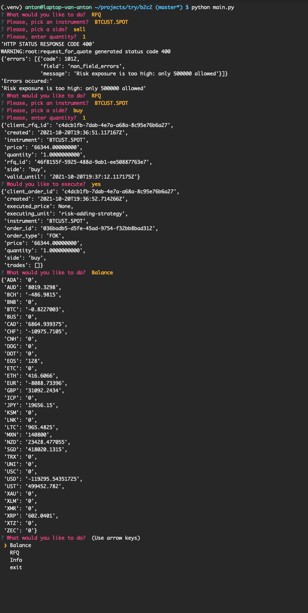

# b2c2

## Install
`pip install -r requirements.txt`

## Usage
python main.py

## Preview

## Todo:
Print out user friendly messages
valid_until check before executing order
Compare order info to a balance (although if account is traded in parallel by other tool - this check is useless)
